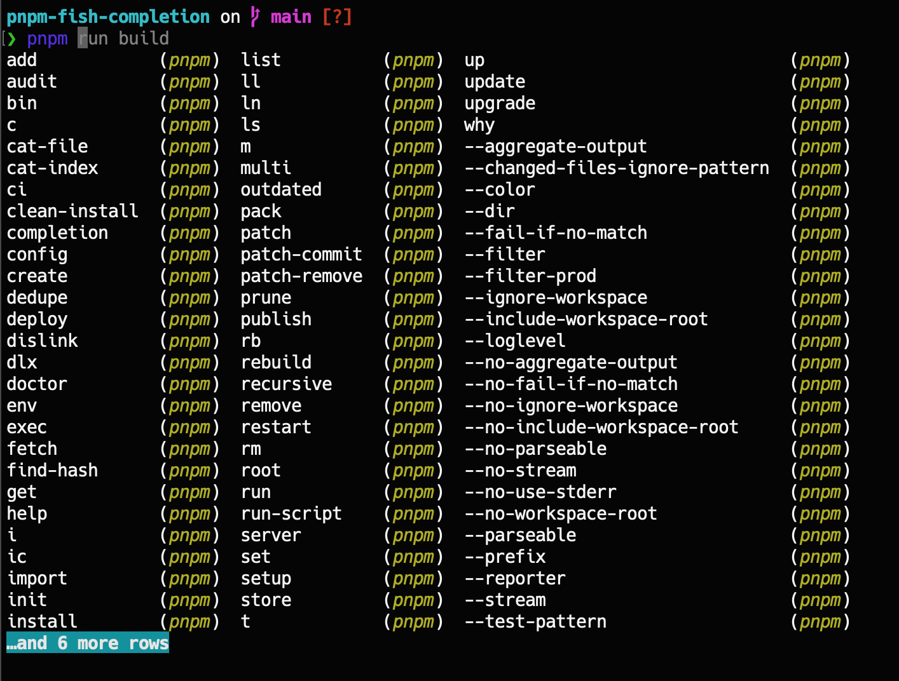

# pnpm fish completion plugin

## Installation

### With [Fisher](https://github.com/jorgebucaran/fisher):

```shell
fisher install zuisong/pnpm-fish-completion
```

### With [fundle](https://github.com/danhper/fundle):

```shell
# Add this to your ~/.config/fish/config.fish 
fundle plugin zuisong/pnpm-fish-completion
```

### Manually

```shell
curl -Lo ~/.config/fish/completions/pnpm.fish \
--create-dirs \
https://raw.githubusercontent.com/zuisong/pnpm-fish-completion/main/completions/pnpm.fish
```

### Demo

